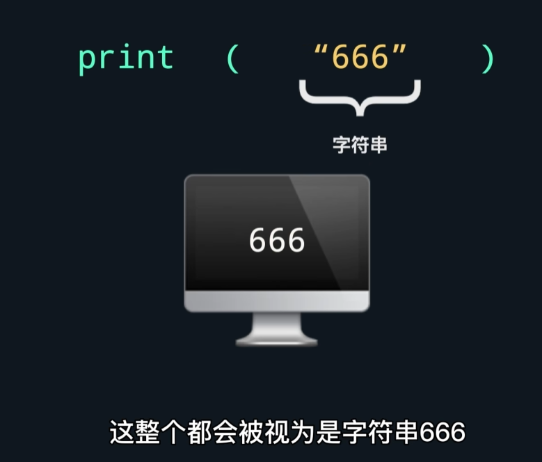
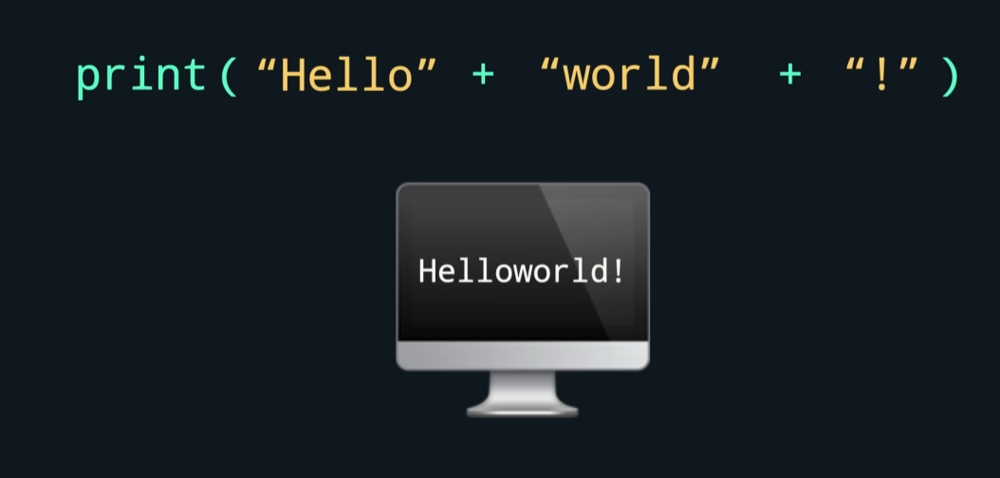
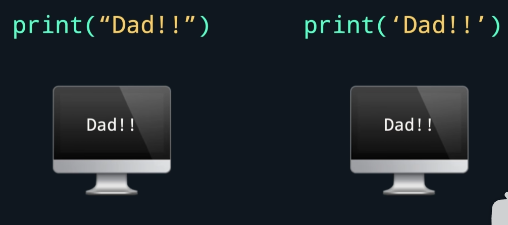
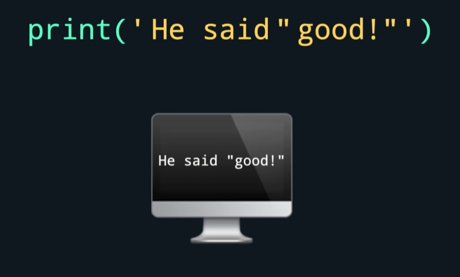
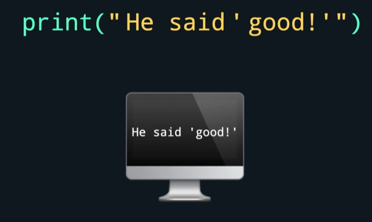
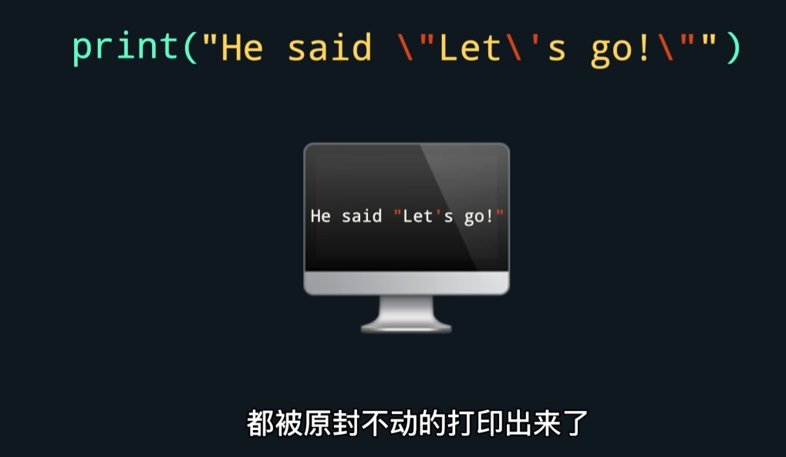
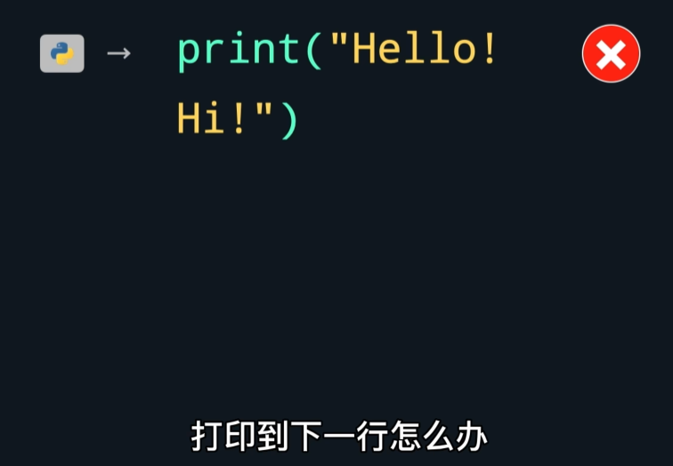
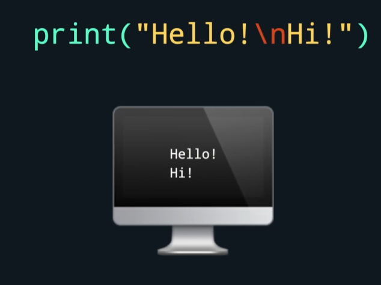
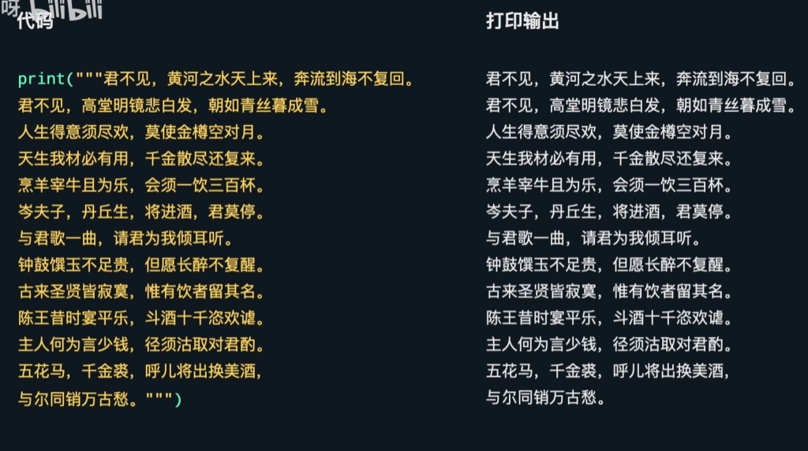

# 有关print

## 格式

[基础格式代码](/code/01_1.py)

### 字符串连接

*hello后或world前没有空格，所以单词会挨在一起*

### 单双引号转义
-字符串用单双引号裹着都可以，效果在绝大多数情况下都一样

第二个双引号和第一个配对，后面的内容回暖报错

外单内双、外双内单不会报错。

如图，字符串内要有多个引号的情况。
在字符串里的引号前面加上反斜杠 \ ——转义符 ，代表引号是字符串内容的一部分，并不表示字符串的结束

### 换行

**注意：每个print默认另起一行**

### 三引号跨行字符串

用三引号（单引号双引号都可以）裹住文字，python会把新一行当作内容的换行，而不是代码语句的结束或不完整。**适用于打印跨行多的内容**

[实操代码](/code/01_2.py)