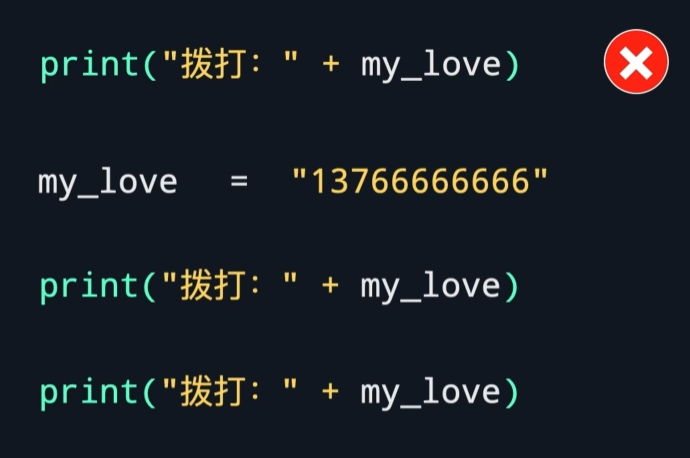
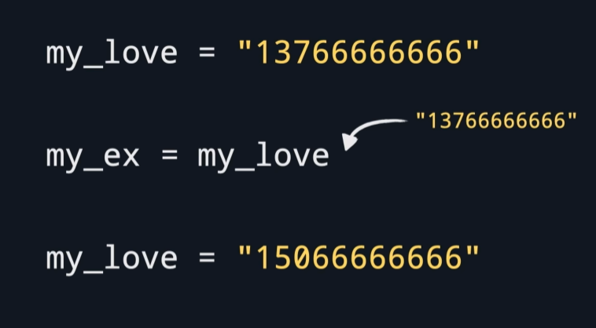

# 变量
依靠变量来获取、储存、更新值。

## 变量名的命名规则
1. 变量名只能由字母、数字、下划线组成
2. 不能用数字打头
3. 尽量见名知意、尽量不要用拼音

- 下划线命名法（python常用）
1. 字母全部小写
2. 不同单词用下划线分隔
user_age  user_gender

- 驼峰命名法
1. 单词用首字母大写分隔
UserAge  UserGender

###注意
1. 变量名大小写敏感
2. 变量名不能占用关键字，如print

*如果打印出来的词是彩色的，一般是关键字*

## 赋值操作

先初始化变量，再使用变量

变量也可用变量赋值

[practice](/code/02_1.py)