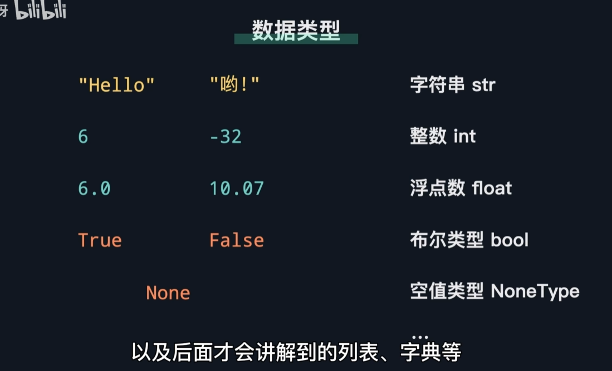
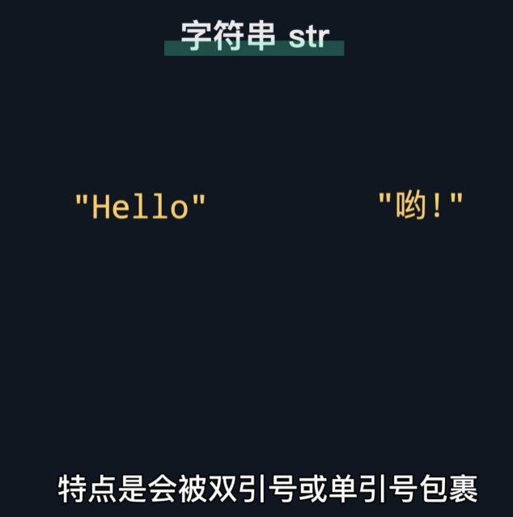
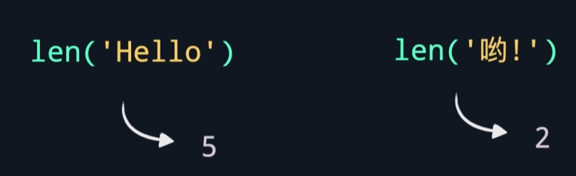
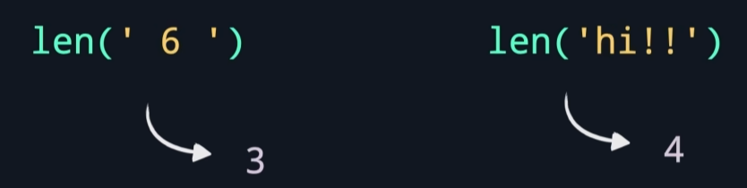
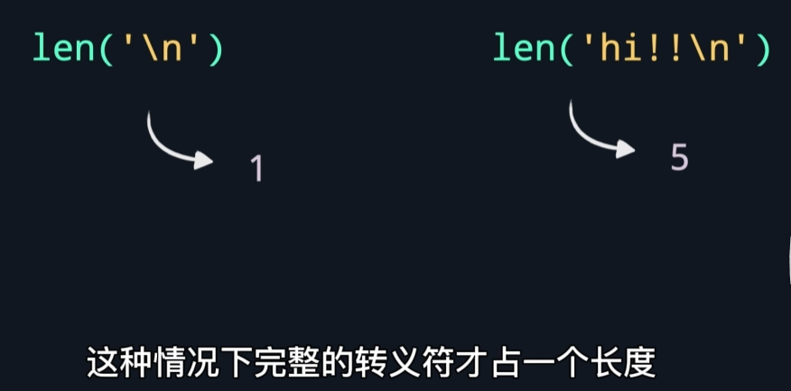
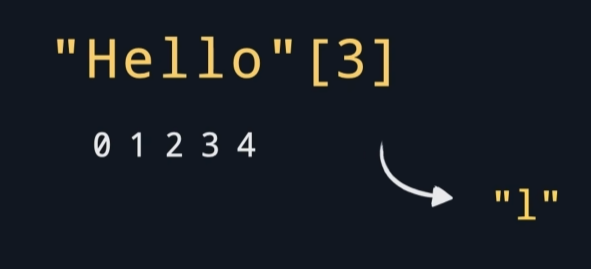
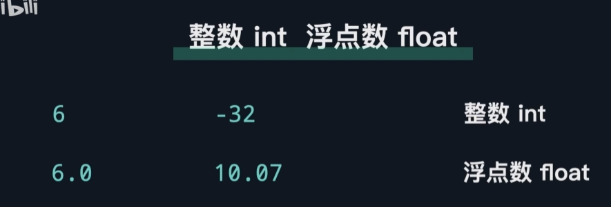
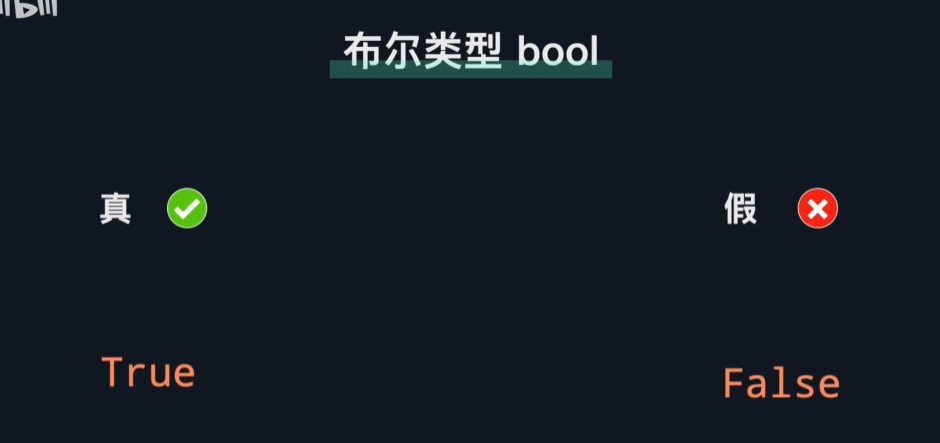
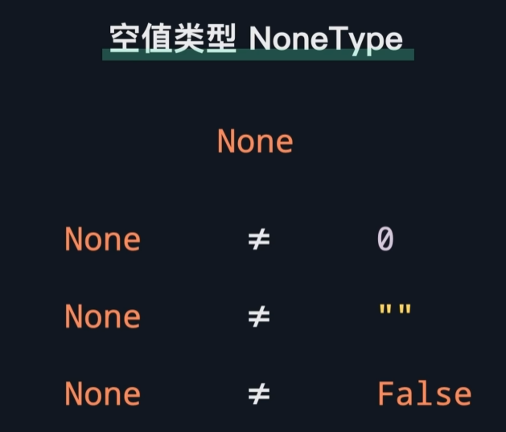
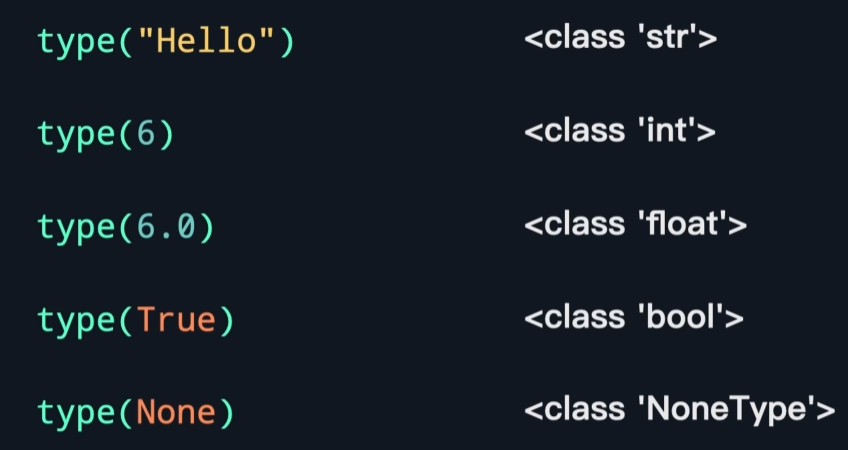

# 数据类型

## 字符串str

-可以对字符串使用len()函数，来获取字符串的长度

无论是空格、数字、字母、符号都会占据一个长度

*但需要注意的是：完整的转义符只占一个长度*

-可以在字符串后面跟上方括号，然后方括号里放索引值，可以提取出该索引位置的字符

## 整数int 浮点数float

## 布尔类型bool

## 空值类型NoneType

表示完全没有值。当不知道当前变量的值是什么时，可以先定义为None

## type函数
当不确定某个对象类型时，可以使用type函数，可以返回该对象的类型

[practice](/code/04_1.py)