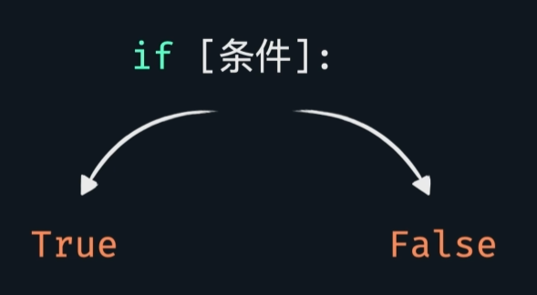
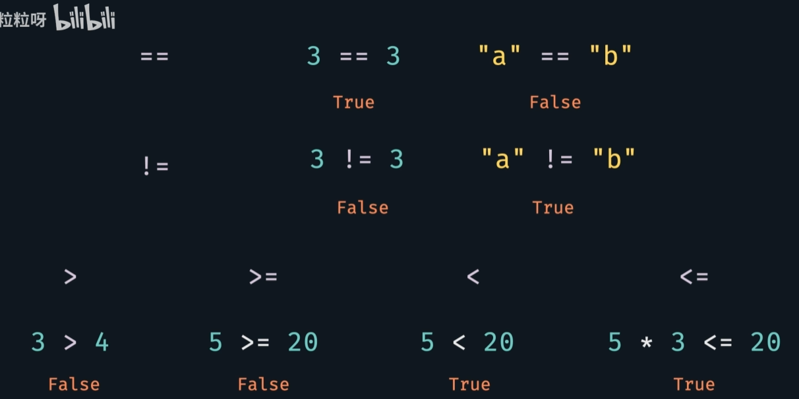
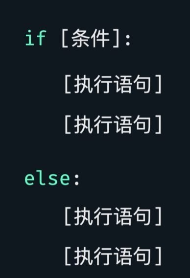
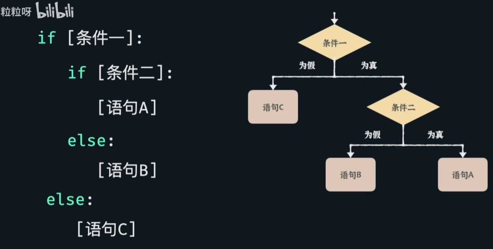
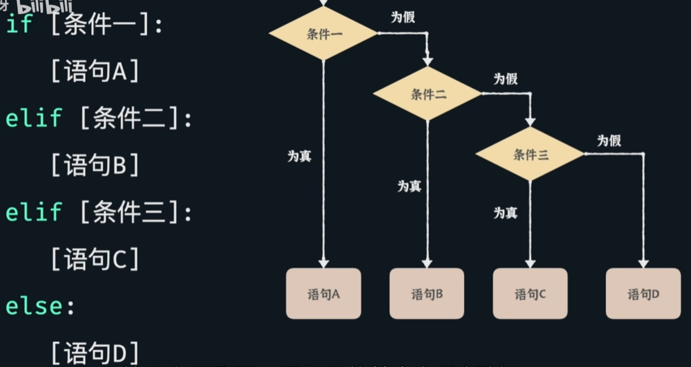

# 条件语句

## 单条件

条件可以是布尔值，也可以是含条件运算符的语句

- 整体

**执行语句前要有缩进——四个空格。因为python会根据是否有缩进来判断该语句是if管、else管、还是压根不属于这一整段条件语句**

[practice](/code/06_1.py)

## 嵌套/多条件 → 嵌套条件语句

**注意缩进！**

- 多个条件判断：elif语句

elif想要几个都可以，数量不限。
**若条件二三同时满足，python只会执行条件二的语句。**

[practice](/code/06_2.py)