# 列表
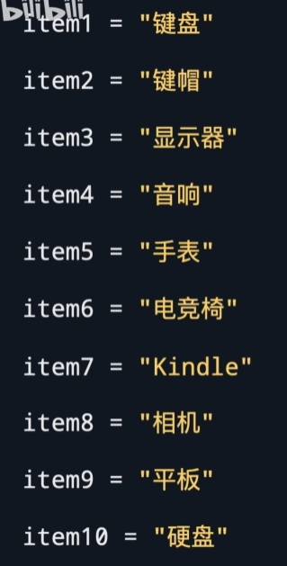
要定义十个变量，一个个赋值，太麻烦了！

## 格式 与 append方法
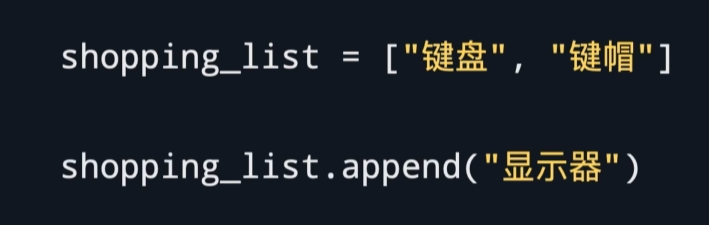
如果想要往列表里加东西，可以使用append方法。

### 方法 和 函数
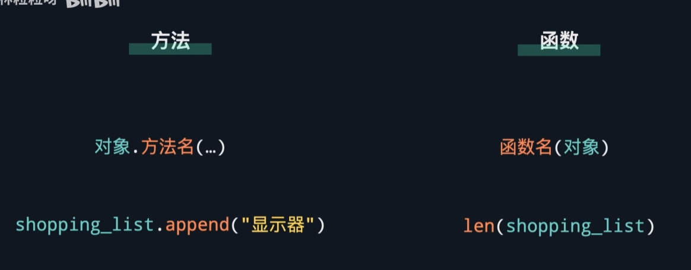

### 可变 和 不可变
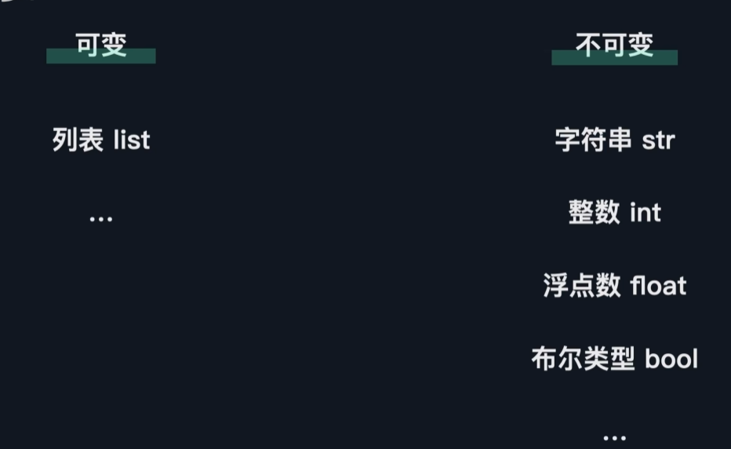

-不可变
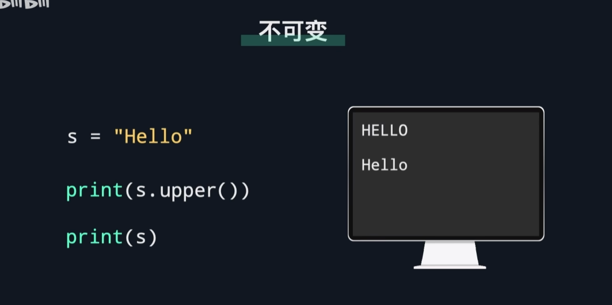
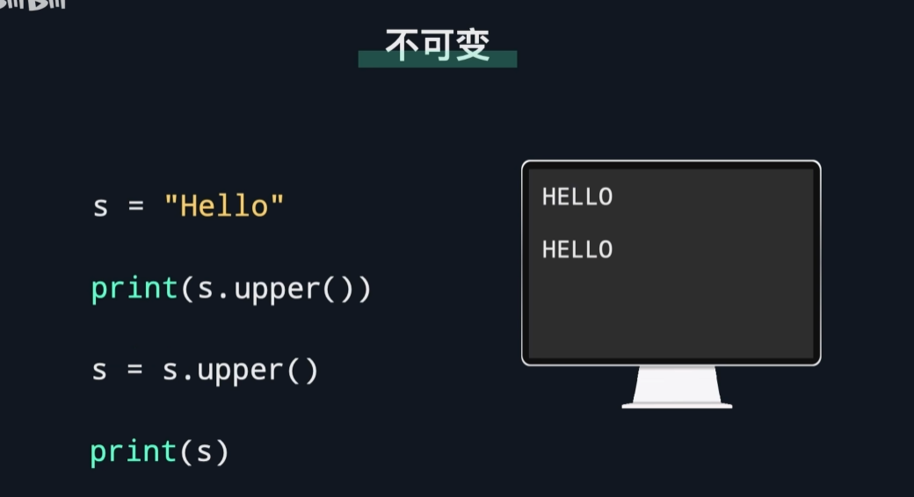

-可变
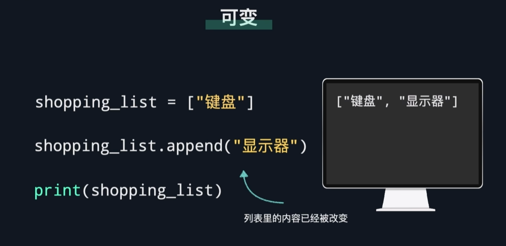
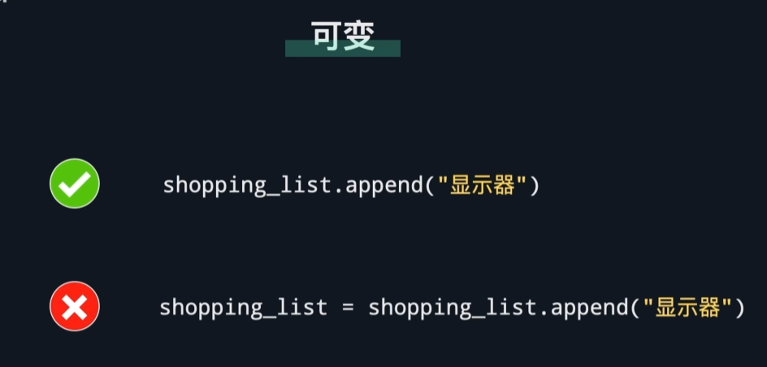
所以使用append方法时，不需要也不应该再对列表重新赋值，因为原先列表已经被改变了。

## remove方法
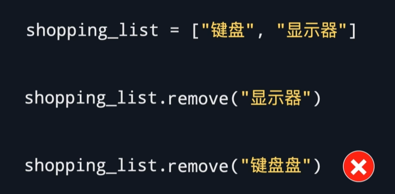

## 与其他很多语言不一样 -- 可以放不同类型数据
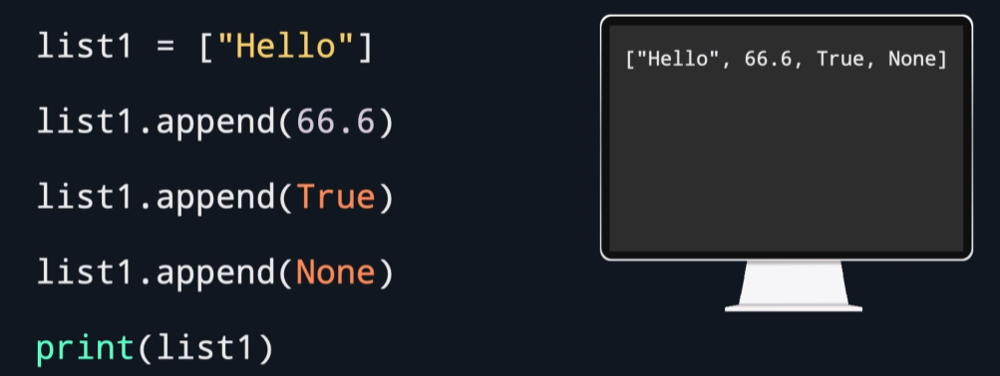

## len()
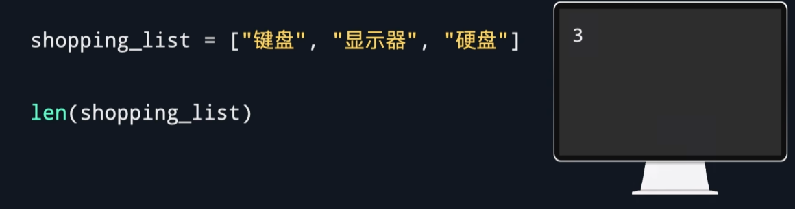
返回列表的元素个数

## 索引
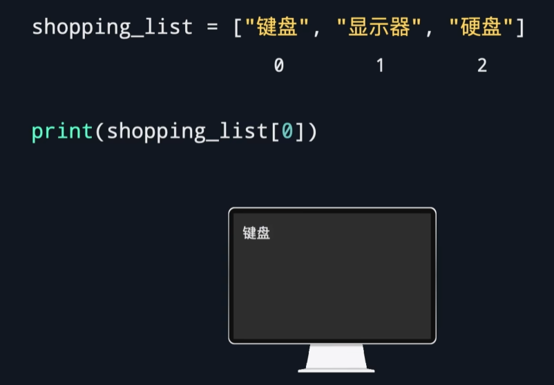

## 其他针对列表的内置函数
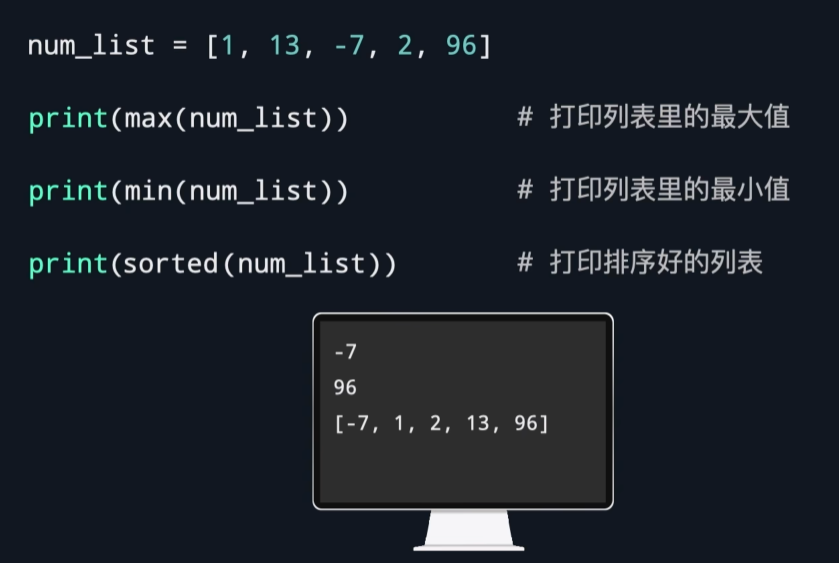

[practice](/code/08_1.py)