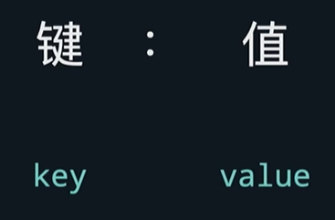
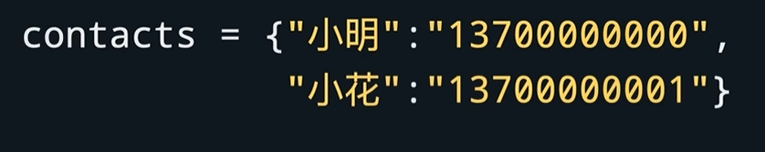
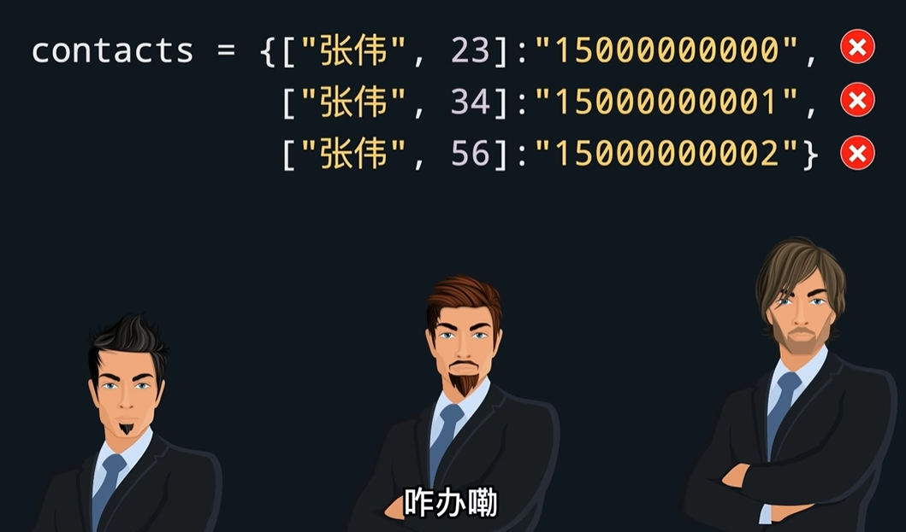
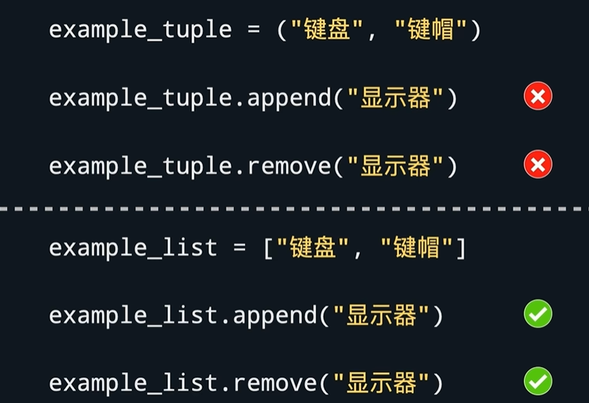
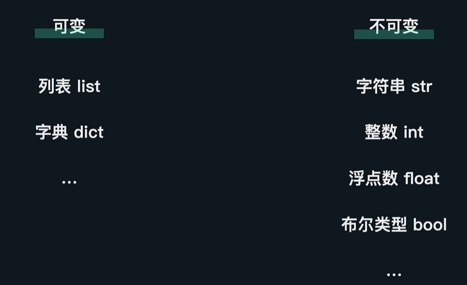
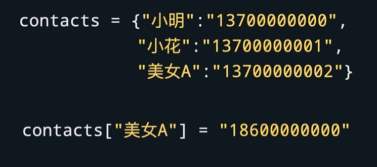
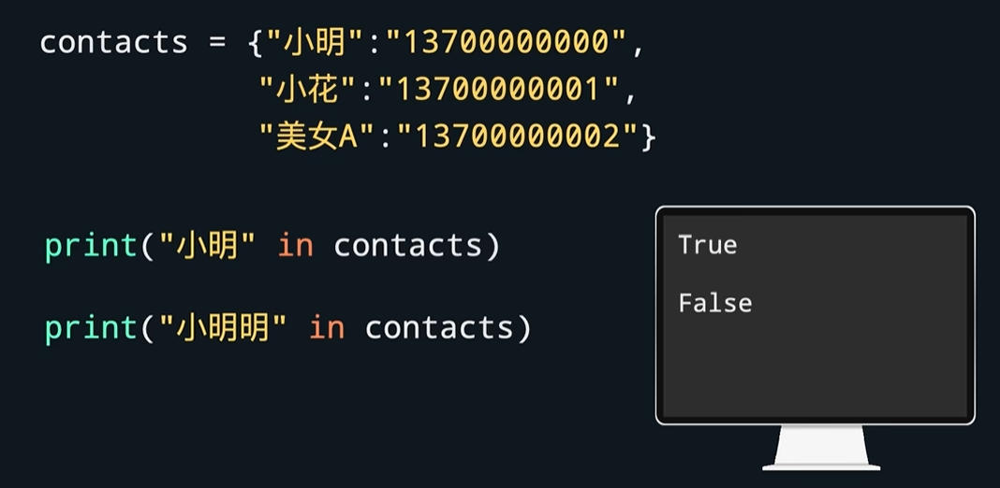
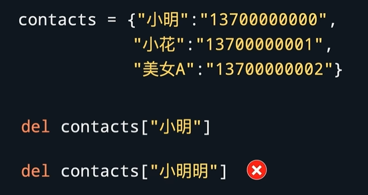
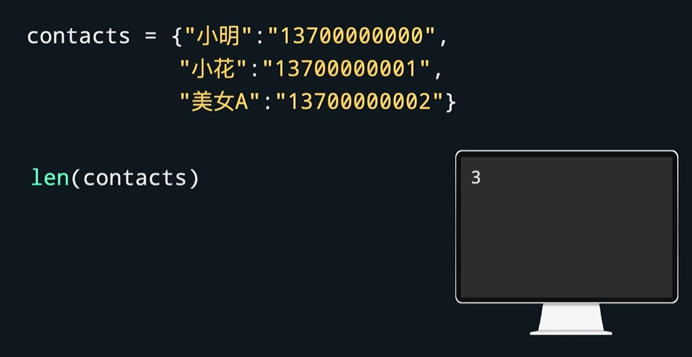
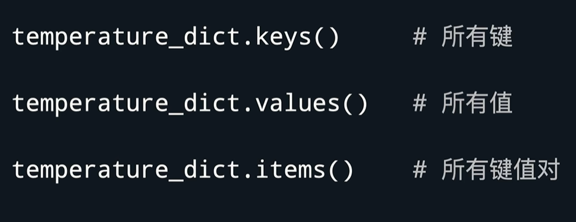

# 字典
字典用于存储键值对

键是用来查找值的。

## 字典格式

如果要获取某个键的值，则在字典名后面跟方括号，里面放键↓

**注意：键的类型必须是不可变的。所以列表不能作为键**

## 元组tuple

-元组用圆括号，列表用方括号。
-由于元组不可变，所以添加append、删除remove等操作不能用

## 字典也是可变的

## 字典的添加和覆盖

若键不存在，则添加。若键已存在，则覆盖。

## 字典的查找
如果想知道某个键是否存在，↓

## 字典的删除

## 字典的键值对个数

## 字典的其他方法

[practice](/code/09_1.py)