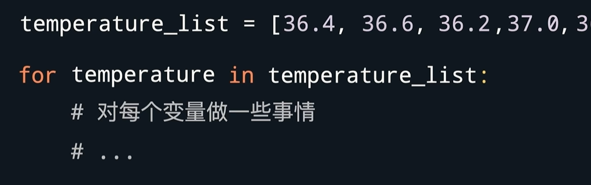
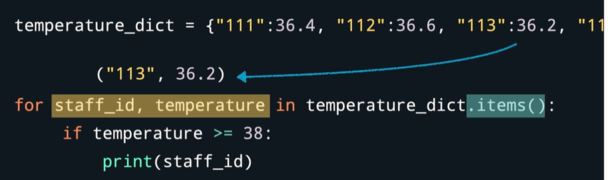
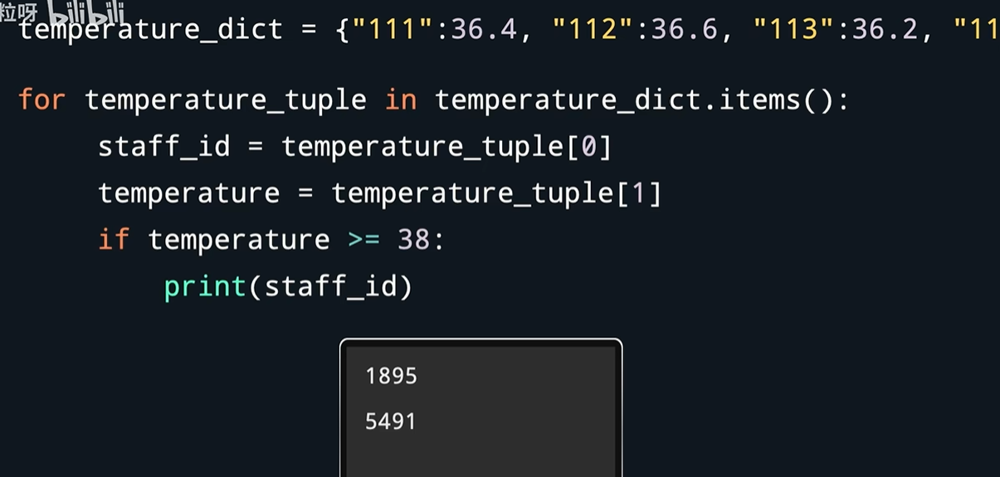
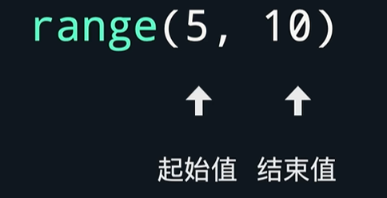
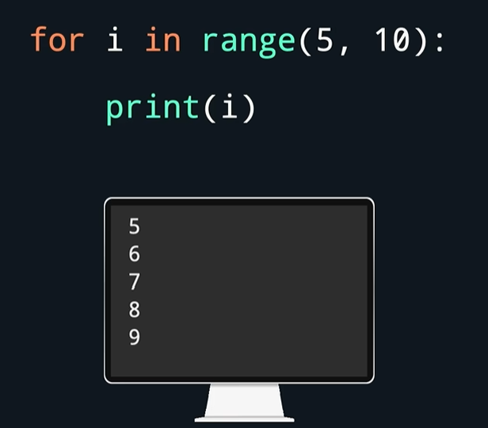
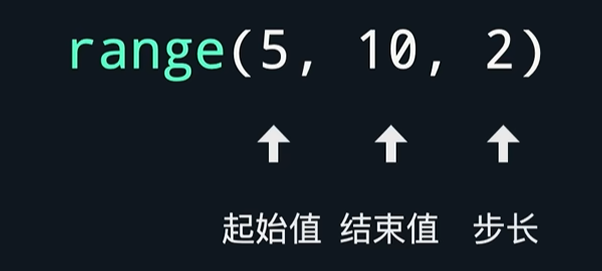
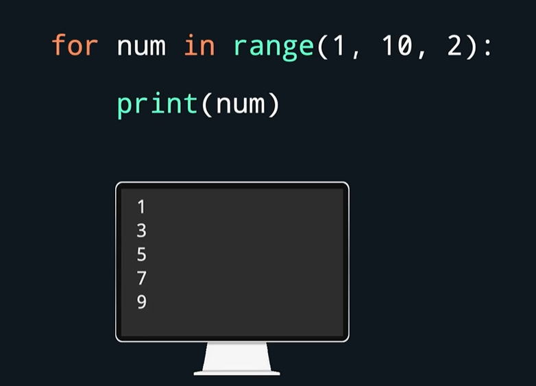
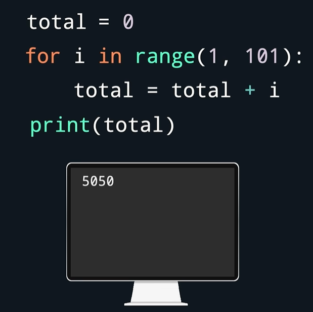

# for循环

例子

**变量名具体叫什么无所谓，不管叫什么，这个变量名会被依次赋值为列表里的每一个元素。**

for语句下每个带缩进的语句，对每个元素都会执行一遍。

## 与 字典 的结合

等价于↓   元组tuple

## 与 range 的结合

range表示整数序列，**注意：结束值不在序列的范围内。**

-步长

步长不写时，默认为1

打印1-10里所有奇数 ↑

1-100所有数求和 ↓
