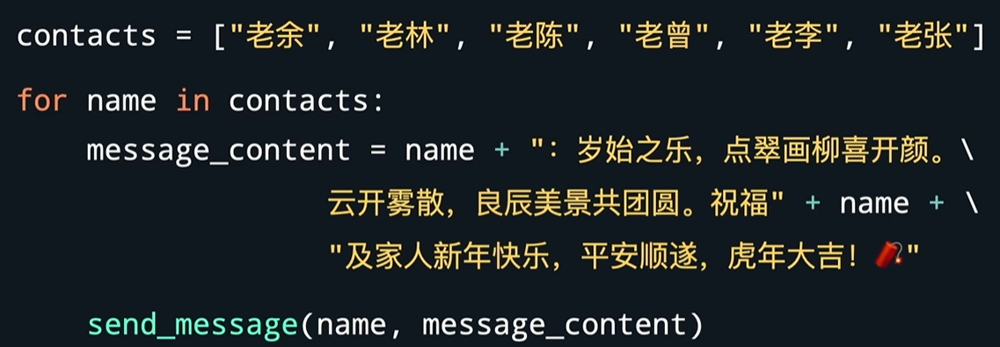
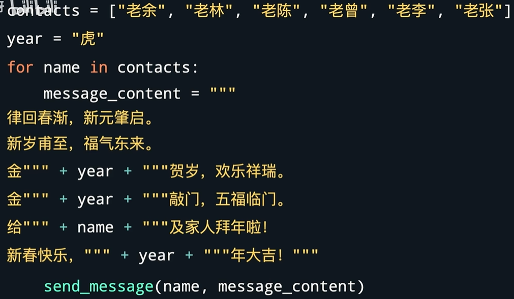
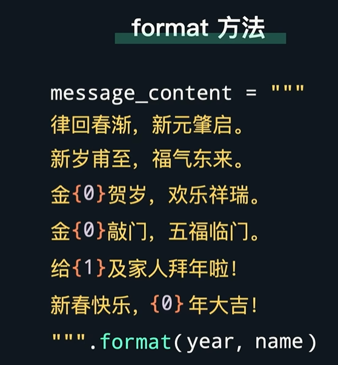
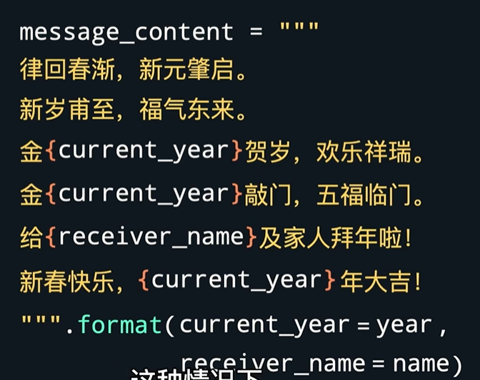
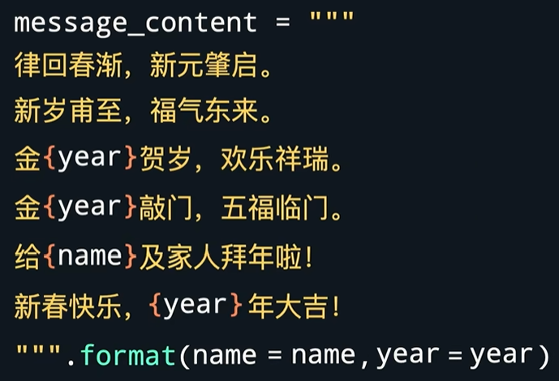
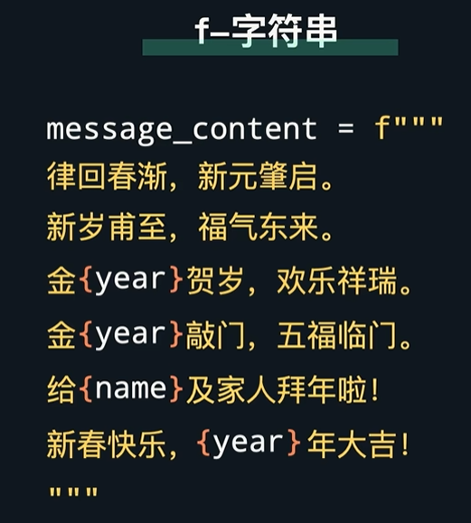
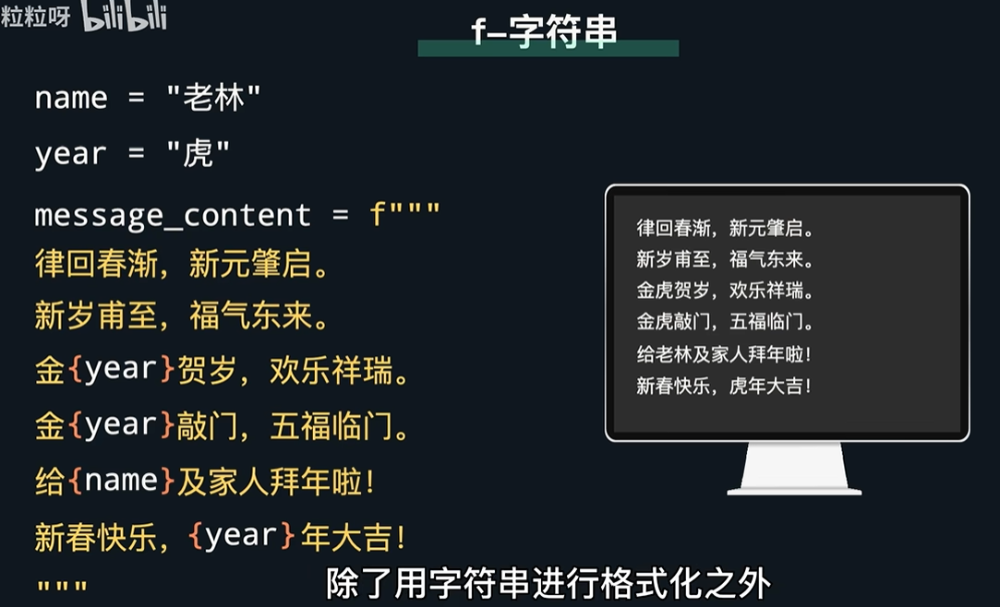
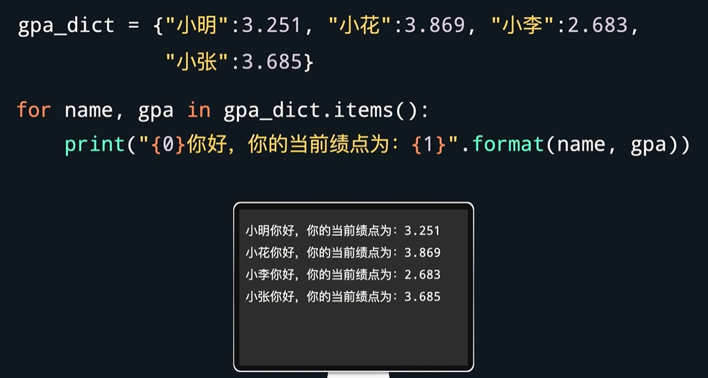
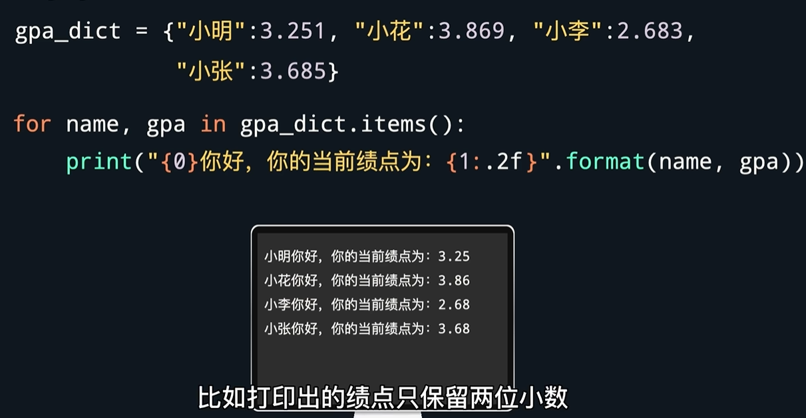
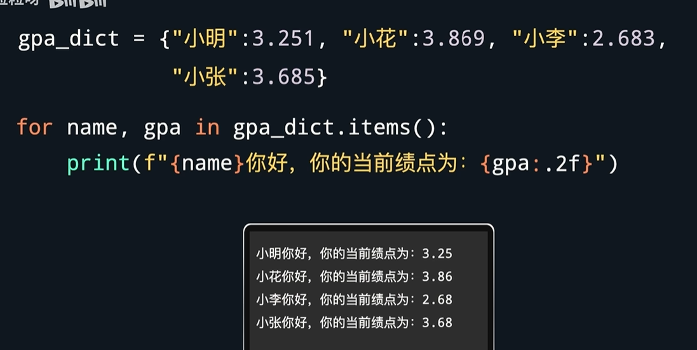

# 格式化字符串

发新年祝福 ↑
要是想把祝福内容改成这样，并且要根据实际情况替换生肖和名字

那么代码可以写成这样 ↓

🤔有没有觉得这段内容很繁琐稀碎不直观不连贯？

## python提供了两种方式，更加简洁优雅地格式化字符串
- format方法
1.

里面的数字表示，会用format里面的第几个参数进行替换
2.

3. 更简洁

- f-字符串

在字符串前加前缀f，花括号里的内容会被直接求值，添加到字符串内。

- 数字也可以对字符串进行格式化

此时，不需要手动将数字转换成字符串就可以打印信息。

↑ （format方法） 保留两位小数的写法 ↓ （f-字符串）
