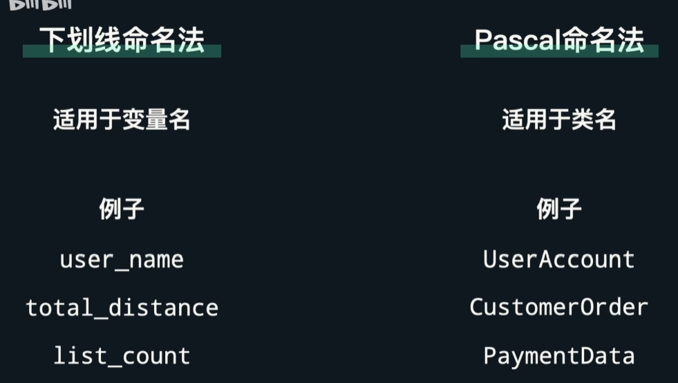
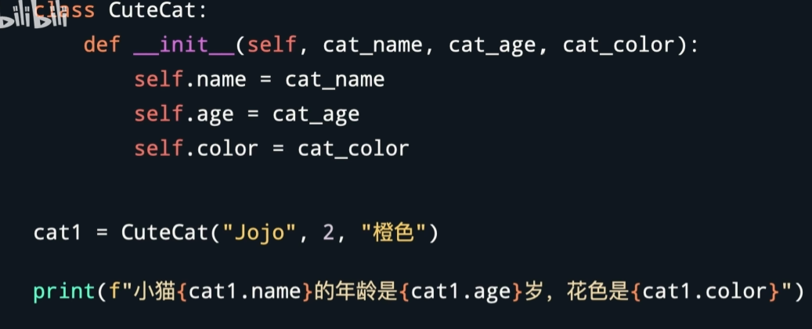
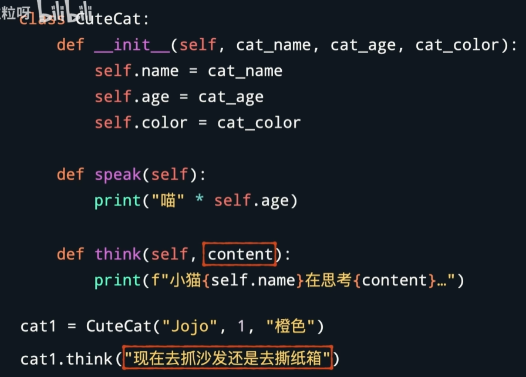

# 创建类
类是创建对象的模板，对象是类的实例。类定义了对象有何种属性和方法，对象拥有的具体属性则可以不尽相同。

类名通常用后者命名法 ↓

## 定义属性、创建对象 
- 实例

**❗构造函数的写法**

**在创建对象时，self不需要传入**

## 定义方法
定义方法和创建普通函数差不多，只有两个区别：
1. 写在class里，前面要有缩进来表示这是属于该类的方法
2. 和__init__一样，第一个参数被占用，用于表示对象自身，约定俗成为self

[practice](/code/15_1.py)