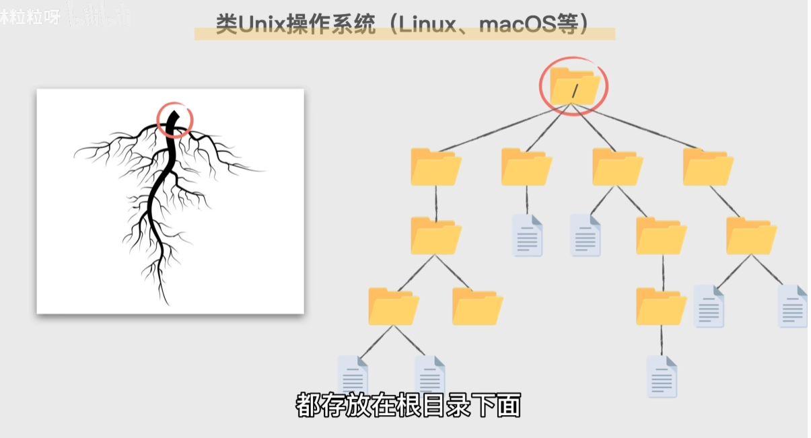
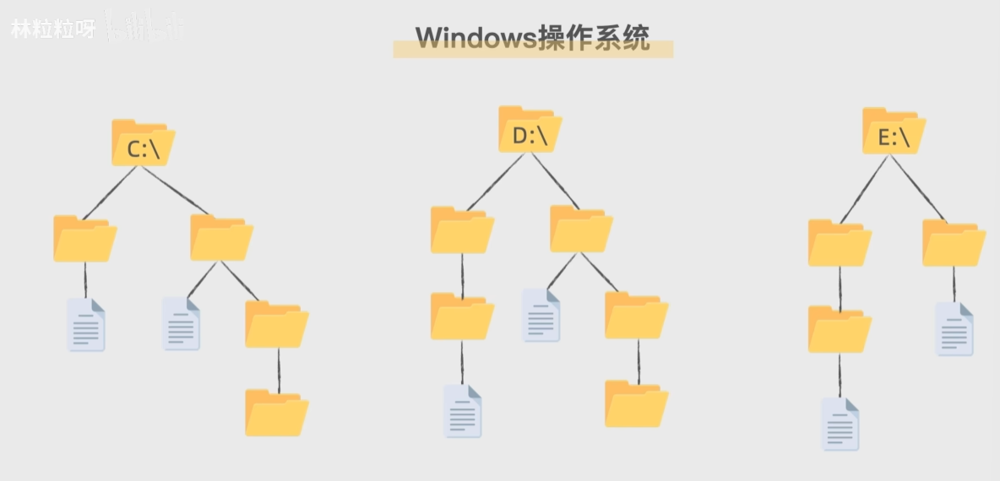
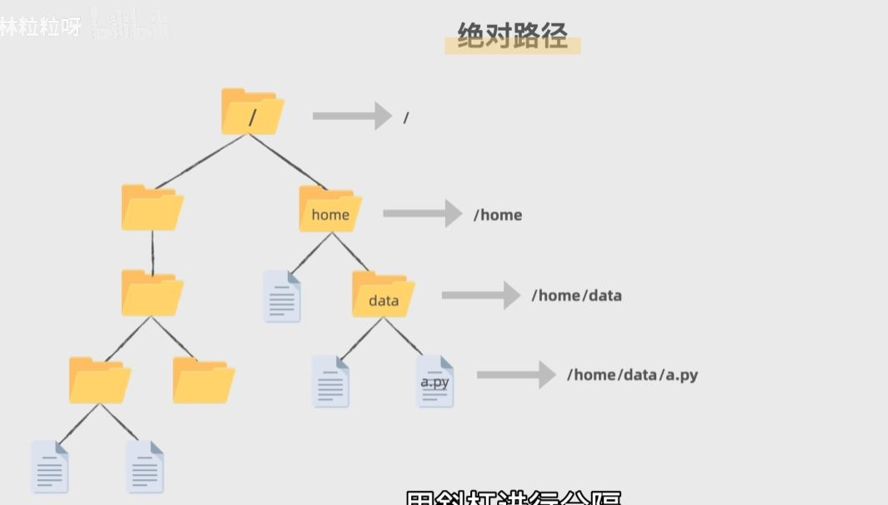
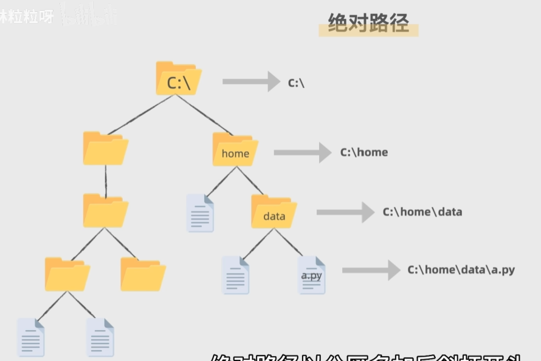
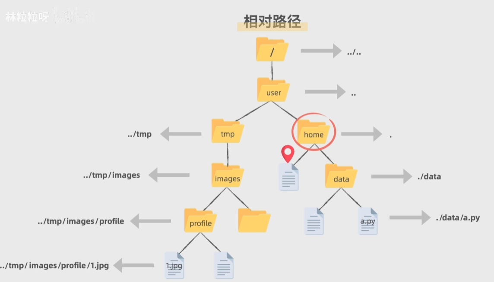
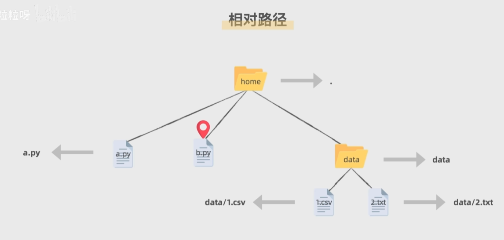

# 文件路径

## 电脑操作系统的目录结构

## 定位文件位置的方法
1. 绝对路径：从根目录出发
- 对于类Unix操作系统

- 对于Windows操作系统

2. 相对路径：从一个参照位置出发，表示从那个位置来看，其他文件处于什么路径
- 用 . 表示参照文件当前所在的目录
- 用 .. 表示更上一层的父目录

- ./是可以省略的,同一目录下的文件想互相用相对路径找到彼此的话,可以直接使用文件名.
