# 文件操作

## 读文件操作
1. 打开目标文件
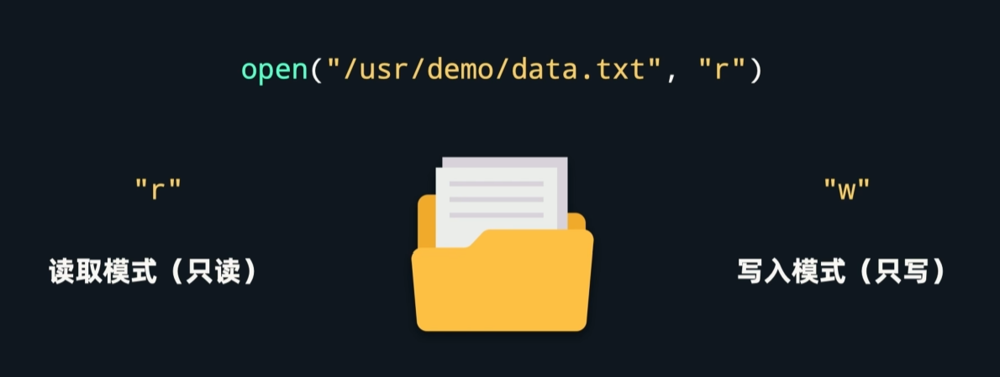
路径(绝对路径/相对路径) + 模式(不写默认为读取模式)

在读取模式下,程序找不到传入的文件名的话,就会报以下错误 ↓ 
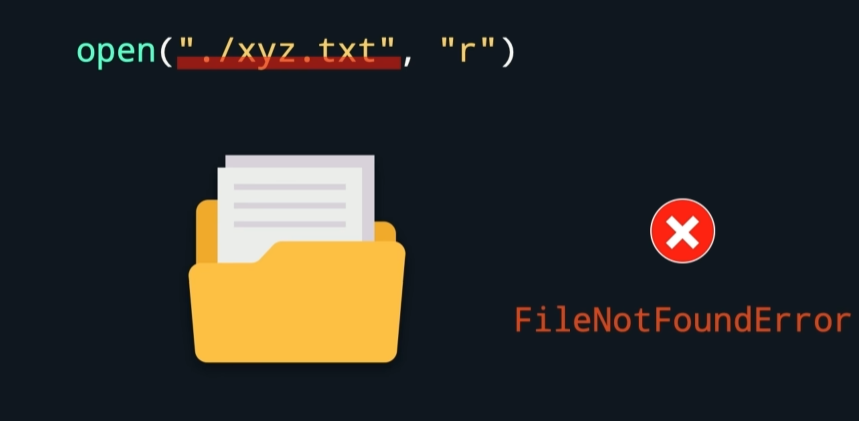

open函数还有个可选参数叫encoding,表示编码方式.现在文件一般编码方式都是UTF-8
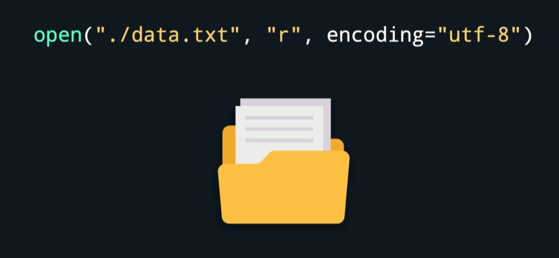

如果open函数返回成功,会返回一个文件对象,可以后续对它进行读取或写入操作
2. 读取文件
- 代码适合读纯文本文件txt,不适合word文件(带高亮字体等易读错)
### read方法
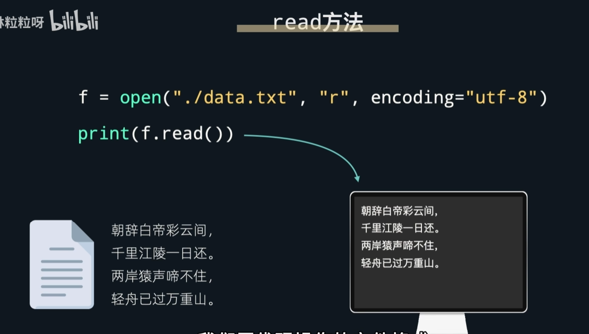
- 第二次read
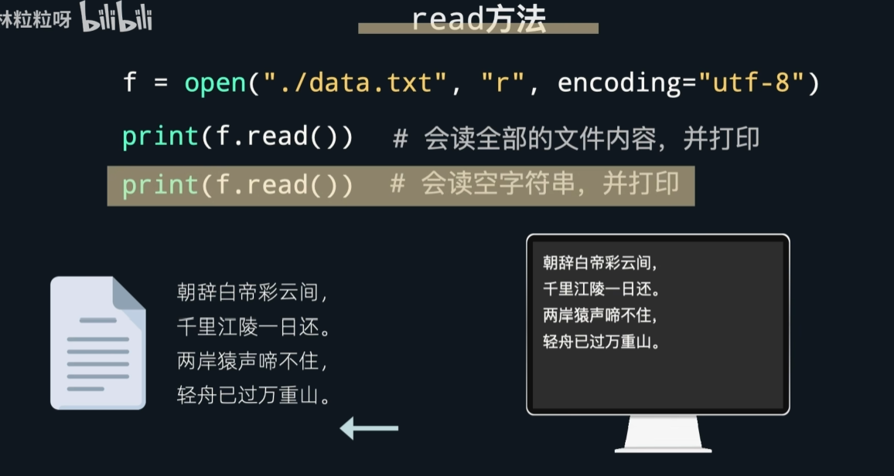
如果调用完read后再次调用,会发现返回的结果为空.

因为程序会记录那个文件读到哪个位置了,第一次read时已经读到结尾,第二次read后面没有内容了,所有会返回空字符串.
- 如果文件特别大,最好不用read
- 不想一次性读完整个文件的操作 ↓ 给read写入数字,表示一次读多少个字节.
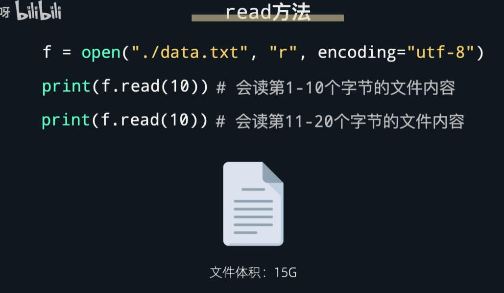

### readline方法
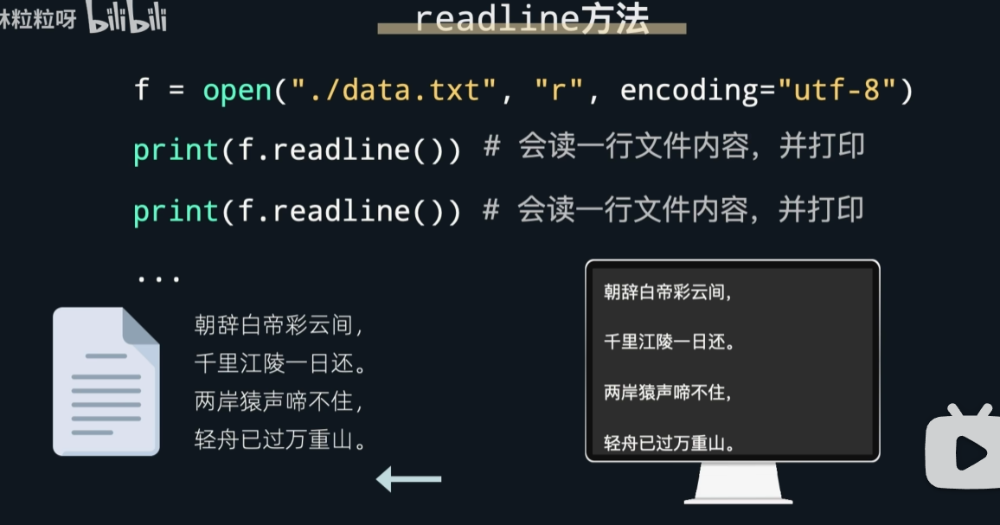
它会根据换行符判断什么时候算本行结尾,而且换行符也会被当成读到的内容的一部分.
- 如果文件有无数行,我怎么知道readline要调用多少次才能读到结尾呢?
如果读到结尾,readline方法会和read一样返回空字符串,所以一般会用while循环判断 ↓ 
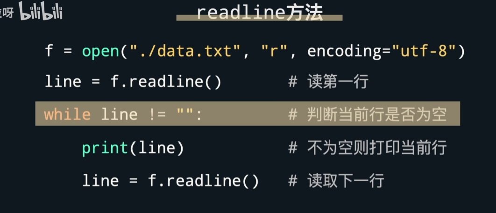

### readlines方法
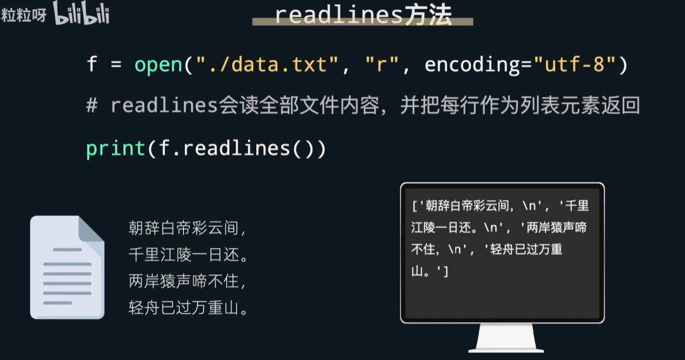
会读取全部文件内容,并返回由每行组成的字符串列表,所以一般和for循环结合使用 ↓
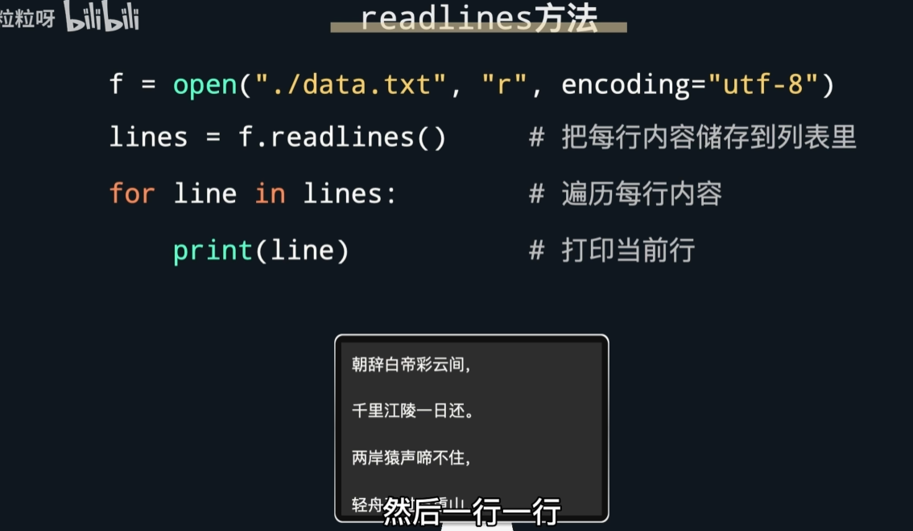

### 总结
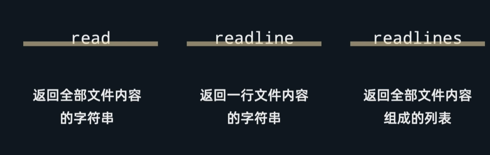

3. 关闭文件
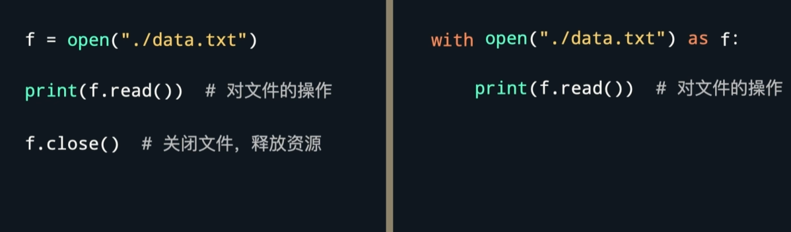
- 左:手动调用close
- 右:缩进的语句块表示对该文件的操作,操作结束后文件会被自动关闭

[practice](/code/18_1.py)