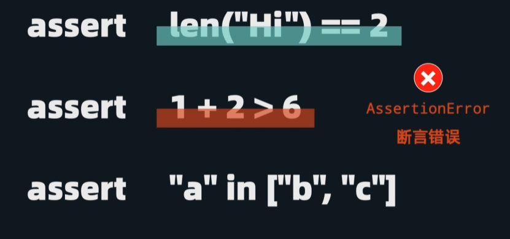
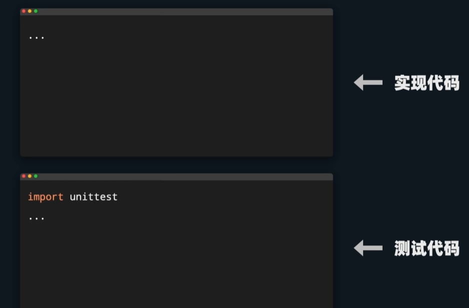
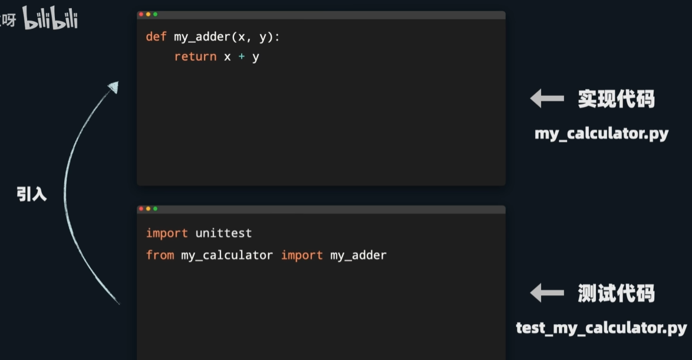
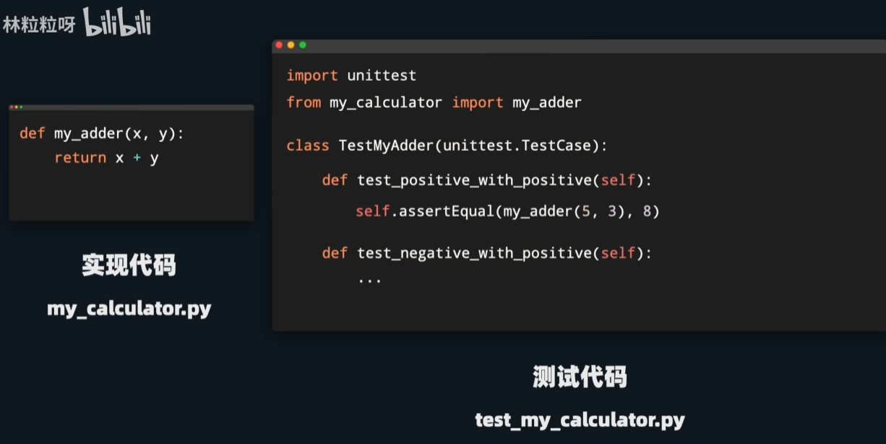
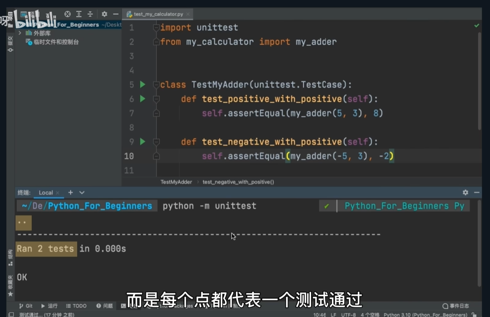
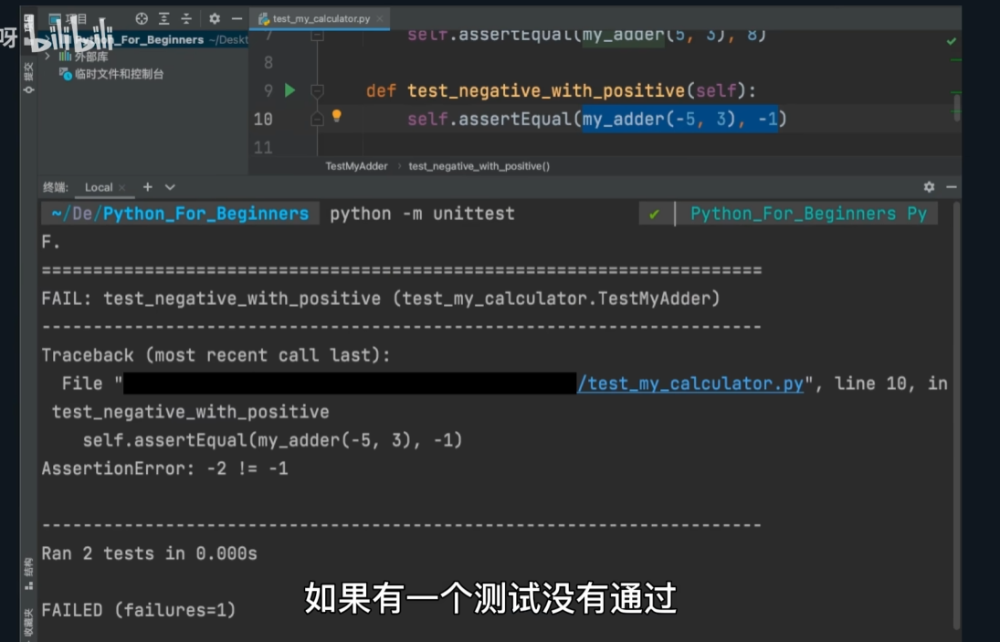
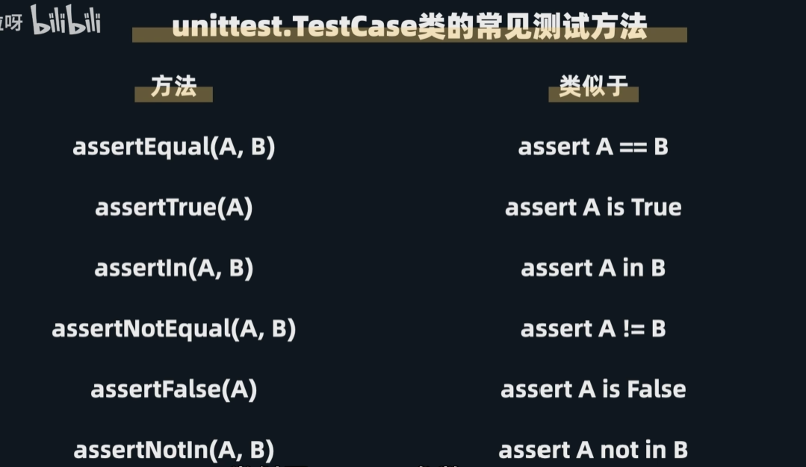
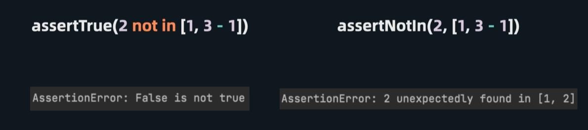
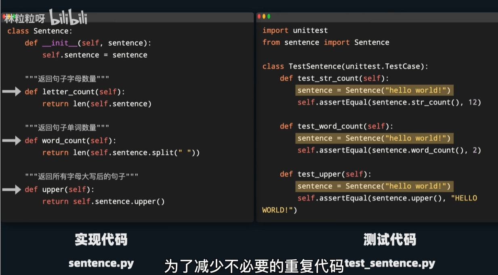
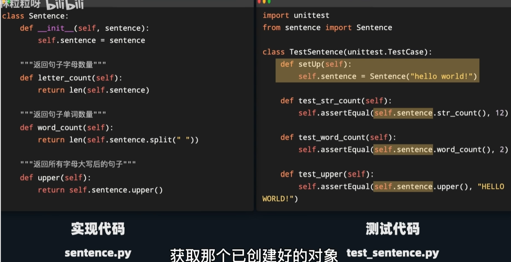

# 测试
## assert语句

assert后面可以跟上任何布尔表达式(值为true或false的表达式).

测试时,我们会在assert后面跟上我们认为应该为true的表达式.如果表达式最终求值出来的结果为true,那么无事发生,继续运行后面的代码.但如果求值出来为false,就会报错.

但有个问题:一旦出现assertionerror,程序就直接中止了,不会运行后面的代码,并不能知道剩下的代码里还有哪些其他问题.

所以一般我们会使用专门做测试的库,能一次性跑多个测试用例,并能更直观地展现哪些测试用例通过了,哪些没有.
## unittest --很常用的python单元测试库
- 需要用import语句,引入到测试程序里
- 一般会把测试代码放到独立文件里,而不是和要测试的功能混在一起.

### 步骤
1. 引入要测试的函数或类
如果测试文件和被测试文件位于同一文件夹下 ↓

2. 创建一个类,名字可以以Test开头,表示这是一个用来测试的类.且要当unittest.TestCase的子类,这样就可以使用继承自父类的各种测试功能
3. 在类下面定义不同的测试用例,每个测试用例都是类下面的一个方法 → 名字必须以test_开头.因为unittest这个库会自动搜索test_开头的方法,并且只把test_开头的方法当成测试用例
4. 调用TestCase类的assertEqual方法.传入的第一个参数和第二个参数如果相等,显示测试通过.如果不相等,显示测试不通过,但程序也不会炸而中止

5. 写好测试用例后,在编辑器终端输入 python -m unittest,表示运行unittest

### unittest.TestCase类的常见测试方法

- 本质上,assertTrue可以代替这些所有方法.在验证2是否不存在于这个列表里,两种测试通过与否的结果一样.但还是推荐更具针对性的方法,而不是万能方法.更针对性的方法可以给出更详细的失败原因

- setUp方法

为了减少不必要的重复创建新对象

在test_开头的方法运行前,setUp方法都会被运行一次.只需要在setUp方法里面把测试对象创建好,作为当前测试类的一个属性
